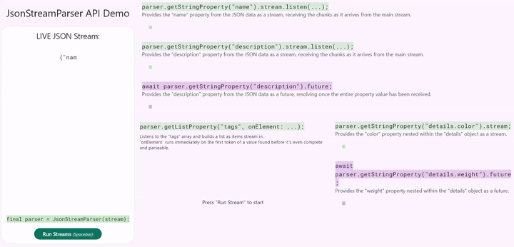

# JSON Stream Parser

[]()
[]()

A streaming JSON parser for Dart that solves the LLM streaming response problem.

## The Problem

Streaming LLM responses in JSON format has a slight problem: An LLM API provides a `Stream<String>`, but the chunks are partial and incomplete tokens of a larger JSON structure:

- CHUNK 1: `{"title": "My G`
- CHUNK 2: `reat Blog Po`
- CHUNK 3: `st", "items": [`
- CHUNK 4: `{"id": 1, "n`
- CHUNK 5: `ame": "Item 1"}`
- CHUNK 6: `]}`


These cannot be easily parsed with standard JSON parsers. Developers are typically forced into two suboptimal solutions:

- **Full Buffering (Slow)**: Wait for the entire stream to finish and then call `jsonDecode()`. This is slow, creates high latency, and completely wastes the benefits of streaming.
- **Raw Output (Broken)**: Append raw chunks directly to a UI. This displays un-parsable, broken text (like `{"title": "My G`) and is not a valid way to handle structured data.
- **Specialized Parsers (Complex)**: Write a specialized streaming parser from scratch. This is complex, error-prone, and time-consuming.

This JSON Stream Parser is designed to solve this exact problem.

## The Solution

This parser functions as a reactive, character-by-character JSON state machine with a clean, high-level API. It parses the stream token-by-token, allowing an application to react to JSON data as it is being formed.



Visit the live demo at: **https://comsindeed.github.io/json_stream_parser_demo/**

### Basic Usage

```dart
import 'package:llm_json_stream/json_stream_parser.dart';

void main() async {
  final llmStream = getLLMStream(); // Returns Stream<String>
  
  final parser = JsonStreamParser(llmStream);
  
  // Subscribe to specific properties
  final titleStream = parser.getStringProperty("title");
  final itemsStream = parser.getListProperty("items");
  
  // React to values as they complete
  titleStream.stream.listen((chunk) {
    print("Title chunk: $chunk");
  });

  // Await full values when needed
  final items = await itemsStream.future;
  print("Full items list received: $items");
}
```

## Three Cool Features

### 1. Streaming String Property Values

The most significant feature is the ability to stream the value of a JSON string property, chunk by chunk.

A traditional parser waits until it has parsed a complete string value (e.g., `"My Great Blog Post"`) before returning it. This parser, via its `StringPropertyStream`, provides a `.stream` that emits chunks of the string's content as they are parsed from the input.

```dart
// Subscribe to the 'title' property
final titleStream = parser.getStringProperty("title");

// Listen to its .stream
titleStream.stream.listen((chunk) {
  // This listener fires multiple times as chunks arrive:
  // 1. Fires with: "My G"
  // 2. Fires with: "reat Blog Po"
  // 3. Fires with: "st"
  
  // This allows a UI widget to update token-by-token
  myTextWidget.text += chunk;
});
```

This enables a UI to display text values as if the AI is typing them directly into the designated field.

### 2. "Arm the Trap" List Handling

This parser changes how JSON arrays are handled. Instead of parsing a complete object and then adding it to a list, the `onElement` callback fires immediately when a new list item is first discovered.

When the parser, while processing an array, encounters the first character of a new element (e.g., an opening `{` or `"`), it fires the `onElement` callback before that element is parsed.

```dart
// Subscribe to the 'items' list
final itemsList = parser.getListProperty("items");

// "Arm the trap"
itemsList.onElement((propertyStream, index) {
  // This fires the MOMENT the LLM starts a new item.
  // It does not wait for the item to be finished.
  
  // 'propertyStream' is a new PropertyStream (like a MapPropertyStream)
  // for this new item that doesn't even fully exist yet.

  // A UI can add a new card to a list *immediately*
  final newCard = MyReactiveCardWidget();
  myListView.add(newCard);

  // The new card can then be given the streams it needs to
  // populate *itself* as its data arrives.
  if (propertyStream is MapPropertyStream) {
    newCard.listenToTitle(propertyStream.getStringProperty("name").stream);
    newCard.listenToId(propertyStream.getNumberProperty("id").future);
  }
});
```

This allows for building UIs that can add new elements instantly and then "fill them in" reactively, creating a highly responsive feel.

### 3. Dual Future and Stream API

The parser's API provides flexibility by offering both a `Future` and a `Stream` for its properties, allowing the developer to choose the correct tool for the job.

- `.stream`: Used for properties (like strings) where receiving partial chunks, token-by-token, is desired.
- `.future`: Used for atomic properties (like `num`, `bool`, or `null`) where the complete value is needed. This `Future` completes as soon as that specific property is fully parsed, even if the rest of the JSON stream is still arriving.

```dart
// For an item {"id": 1245, "name": "Item 1"} being parsed by an onElement callback:
if (propertyStream is MapPropertyStream) {
  
  // 1. Use the .future for the ID.
  // This completes as soon as the '1245' is parsed.
  final id = await propertyStream.getNumberProperty("id").future;
  print('Got the ID: $id. Fetching more data...');
  
  // 2. Use the .stream for the name.
  // This streams "Item" then " 1" as chunks arrive.
  // Useful for updating a UI widget.
  element.getStringProperty("name").stream.listen((chunk) {
    myCardWidget.title += chunk;
  });
}
```

This API design allows a developer to choose the exact level of reactivity needed for every single field in the JSON.

## Syntax Examples

### Direct Path Access

```dart
// Simple property
parser.getStringProperty("title")

// Nested property
parser.getStringProperty("user.name")

// Array element
parser.getStringProperty("items[0].name")

// Deep nesting
parser.getNumberProperty("data.users[2].profile.age")
```

### Chainable Access

```dart
// Get a map, then chain to its properties
final userMap = parser.getMapProperty("user");
final name = userMap.getStringProperty("name");
final age = userMap.getNumberProperty("age");

// Get a list, then access elements
final items = parser.getListProperty("items");
final firstItem = items.getMapProperty("[0]");
final price = firstItem.getNumberProperty("price");
```

### Dynamic List Iteration

```dart
final items = parser.getListProperty("items");

items.onElement((element, index) {
  print("New element at index $index");
  
  if (element is MapPropertyStream) {
    element.getStringProperty("name").stream.listen((name) {
      print("Item $index name: $name");
    });
  }
});
```

## API Reference

### JsonStreamParser

```dart
JsonStreamParser(Stream<String> stream)

StringPropertyStream getStringProperty(String path)
NumberPropertyStream getNumberProperty(String path)
BooleanPropertyStream getBooleanProperty(String path)
NullPropertyStream getNullProperty(String path)
MapPropertyStream getMapProperty(String path)
ListPropertyStream getListProperty(String path)
```

### PropertyStream Types

All property streams have:
- `.stream` - Emits chunks as they are parsed
- `.future` - Completes with the final value

**MapPropertyStream** and **ListPropertyStream** are chainable - you can call property getters on them to access nested data.

**StringPropertyStream**, **NumberPropertyStream**, **BooleanPropertyStream**, and **NullPropertyStream** are terminal - they represent final values.

### ListPropertyStream Special Method

```dart
void onElement(void Function(PropertyStream element, int index) callback)
```

Registers a callback that fires immediately when a new array element is discovered, before it's fully parsed.

**Note:** You can set `onElement` callbacks on nested lists in two ways:

1. When calling `getListProperty()`:
```dart
// Set callback when getting the list
final items = parser.getListProperty('items', onElement: (element, index) {
  print('New item at index $index');
});

// Or on nested lists
final nestedList = mapStream.getListProperty('nested', onElement: (element, index) {
  print('Nested element at index $index');
});
```

2. After getting the list stream:
```dart
// Get the list first
final items = parser.getListProperty('items');

// Set callback later
items.onElement((element, index) {
  print('New item at index $index');
});
```

### Parser Disposal

```dart
Future<void> dispose()
```

Disposes the parser and cleans up all resources to prevent memory leaks. This method:
- Cancels the stream subscription
- Closes all stream controllers
- Completes any pending futures with an error (if not already completed)
- Clears all internal state

```dart
final parser = JsonStreamParser(llmStream);

// Use the parser...
final titleStream = parser.getStringProperty("title");
await titleStream.future;

// Clean up when done
await parser.dispose();
```

**Important:** After calling `dispose()`, the parser instance should not be used.

## What It Supports

- ✅ All JSON types: strings, numbers, booleans, null, objects, arrays
- ✅ Nested structures of any depth
- ✅ Escape sequences in strings
- ✅ Scientific notation for numbers
- ✅ Multiline JSON with whitespace
- ✅ Streaming string values chunk-by-chunk
- ✅ Reactive list element discovery
- ✅ Path-based and chainable property access

## Demos

<!-- Placeholder for demo GIFs - will work on both pub.dev and GitHub -->

_Coming soon: Interactive demos showing real-time LLM streaming_

## Status

⚠️ **Early Release** - This is an initial release (0.1.0). The package is well-tested and functional, but the API may evolve based on user feedback. Please report any issues you encounter.

**160 tests passing** - Core functionality is well-tested and ready for use.

## Installation

```yaml
dependencies:
  llm_json_stream: ^0.1.0
```

## License

MIT
