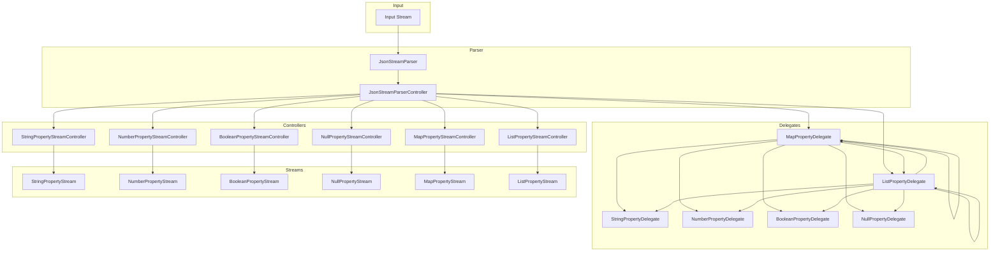

# JSON Stream Parser - Contributor Documentation

Welcome to the JSON Stream Parser contributor documentation! This guide will help you understand the internal architecture and how all the components work together.

## Table of Contents

1. [Architecture Overview](./architecture-overview.md)
2. [Core Components](./core-components.md)
3. [Delegates](./delegates.md)
4. [Property Streams & Controllers](./property-streams-controllers.md)
5. [Mechanisms & Systems](./mechanisms.md)
6. [Data Flow](./data-flow.md)

## Quick Start for Contributors

### Project Structure

```
lib/
├── llm_json_stream.dart          # Public API exports
└── src/
    ├── json_stream_parser.dart   # Main parser class
    ├── property_delegate.dart    # Base delegate class
    ├── *_property_delegate.dart  # Type-specific delegates
    ├── property_stream.dart      # Stream wrapper classes
    ├── property_stream_controller.dart # Stream controllers
    ├── delegator_mixin.dart      # Delegate factory
    ├── property_getter_mixin.dart # Property getter helpers
    └── parse_event.dart          # Logging/observability
```

### Key Concepts

1. **Character-by-Character Parsing**: The parser processes JSON one character at a time
2. **Delegate Pattern**: Each JSON value type has a dedicated delegate that handles parsing
3. **Path-Based Access**: Properties are accessed via dot-notation paths (e.g., `user.name`)
4. **Reactive Streams**: Values are emitted as they're parsed, not just when complete

### Getting Started

```bash
# Run tests
dart test

# Run a specific test file
dart test test/properties/string_property_test.dart

# Run with coverage
dart test --coverage
```

## Architecture at a Glance



## Need Help?

- Check the [detailed architecture documentation](./architecture-overview.md)
- Look at existing tests for usage examples
- File an issue on GitHub for questions
