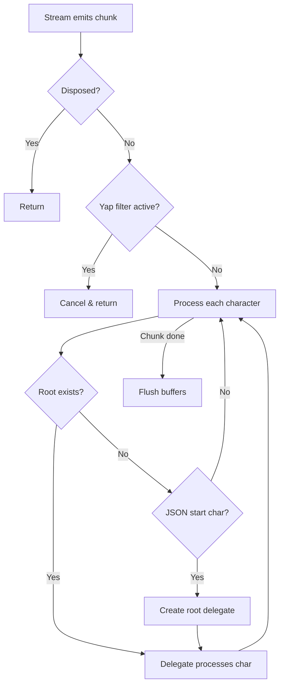

# Core Components

This document details the core components of the JSON Stream Parser.

## JsonStreamParser

**Location:** `lib/src/json_stream_parser.dart`

The main entry point for users. This class orchestrates the entire parsing process.

### Responsibilities

1. **Stream Consumption**: Listens to the input `Stream<String>` and processes chunks
2. **Root Delegate Management**: Creates and manages the root delegate (Map or List)
3. **Controller Registry**: Maintains a map of property path → PropertyStreamController
4. **Public API**: Provides getter methods (`getStringProperty()`, `getMapProperty()`, etc.)
5. **Yap Filter**: Implements auto-stop when root JSON completes

### Key Fields

```dart
class JsonStreamParser {
  // Input handling
  final Stream<String> _stream;
  StreamSubscription<String> _streamSubscription;
  
  // Internal coordination
  late final JsonStreamParserController _controller;
  
  // State tracking
  PropertyDelegate? _rootDelegate;
  bool _isDisposed = false;
  
  // Controller registry
  final Map<String, PropertyStreamController> _propertyControllers 
### Key Methods

| Method | Purpose |
|--------|---------|
| `getStringProperty(path)` | Get/create a StringPropertyStream |
| `getNumberProperty(path)` | Get/create a NumberPropertyStream |
| `getBooleanProperty(path)` | Get/create a BooleanPropertyStream |
| `getNullProperty(path)` | Get/create a NullPropertyStream |
| `getMapProperty(path)` | Get/create a MapPropertyStream |
| `getListProperty(path)` | Get/create a ListPropertyStream |
| `dispose()` | Clean up resources |

### Parsing Flow



> **Note**: The "Yap filter" stops parsing after the root JSON completes, ignoring any trailing LLM text.

---

## JsonStreamParserController

**Location:** `lib/src/json_stream_parser.dart` (bottom of file)

An internal facade that provides delegates with controlled access to parser functionality.

### Responsibilities

1. **Abstraction Layer**: Hide parser internals from delegates
2. **Property Chunk Routing**: Route parsed values to correct controllers
3. **Controller Access**: Provide delegates access to stream controllers
4. **Logging**: Forward log events to parser's log callback

### Interface

```dart
class JsonStreamParserController {
  // Send a parsed chunk to a property's stream
  final void Function<T>({required String propertyPath, required T chunk}) addPropertyChunk;
  
  // Get a property stream controller by path
  final PropertyStreamController Function(String propertyPath) getPropertyStreamController;
  
  // Get or create a PropertyStream for a path and type
  final PropertyStream Function(String propertyPath, Type streamType) getPropertyStream;
  
  // Emit a log event
  final void Function(ParseEvent event) emitLog;
}
```

### Why This Exists

The controller pattern allows:
1. **Testability**: Delegates can be tested with mock controllers
2. **Encapsulation**: Delegates don't need direct parser references
3. **Flexibility**: Controller implementation can change without affecting delegates

---

## PropertyGetterMixin

**Location:** `lib/src/property_getter_mixin.dart`

A mixin that provides property getter methods to both `JsonStreamParser` and `PropertyStream` classes.

### Responsibilities

1. **Code Reuse**: Share getter implementations across classes
2. **Path Building**: Construct full property paths from relative keys
3. **Type-Safe Access**: Provide typed getters for each JSON type

### Interface

```dart
mixin PropertyGetterMixin {
  // Build full path from relative key
  String buildPropertyPath(String key);
  
  // Access to parser controller
  JsonStreamParserController get parserController;
  
  // Getter methods (shared implementation)
  StringPropertyStream getStringProperty(String key);
  NumberPropertyStream getNumberProperty(String key);
  BooleanPropertyStream getBooleanProperty(String key);
  NullPropertyStream getNullProperty(String key);
  MapPropertyStream getMapProperty(String key);
  ListPropertyStream<E> getListProperty<E>(String key);
  
  // Shorthand aliases
  dynamic str(String key);
  BooleanPropertyStream boolean(String key);
  NumberPropertyStream number(String key);
  NullPropertyStream nil(String key);
  MapPropertyStream map(String key);
  ListPropertyStream<E> list<E>(String key);
}
```

### Path Building Examples

| Context | Key | Result |
|---------|-----|--------|
| Root parser | `"name"` | `"name"` |
| MapPropertyStream at `"user"` | `"name"` | `"user.name"` |
| ListPropertyStream at `"items"` | `"[0]"` | `"items[0]"` |
| ListPropertyStream at `"users"` | `"name"` | `"users.name"` |

---

## Delegator Mixin

**Location:** `lib/src/delegator_mixin.dart`

A factory mixin that creates the appropriate delegate based on the first character of a JSON value.

### Responsibilities

1. **Delegate Factory**: Create delegates based on value type indicators
2. **Character Routing**: Map first characters to delegate types

### Character Mapping

```dart
switch (character) {
  case '{':  return MapPropertyDelegate(...);
  case '[':  return ListPropertyDelegate(...);
  case '"':  return StringPropertyDelegate(...);
  case 't':
  case 'f':  return BooleanPropertyDelegate(...);
  case 'n':  return NullPropertyDelegate(...);
  case '-':
  case '0'-'9': return NumberPropertyDelegate(...);
}
```

### Usage

The mixin is used by:
- `PropertyDelegate` (base class)
- `MapPropertyDelegate` (creates child delegates)
- `ListPropertyDelegate` (creates child delegates)

---

## ParseEvent

**Location:** `lib/src/parse_event.dart`

Data class for observability/logging events.

### Fields

```dart
class ParseEvent {
  final ParseEventType type;    // Type of event
  final String propertyPath;    // Path where event occurred
  final String message;         // Human-readable description
  final DateTime timestamp;     // When event occurred
  final Object? data;          // Optional associated data
}
```

### Event Types

| Type | Description |
|------|-------------|
| `propertyStart` | A property started being parsed |
| `propertyComplete` | A property finished parsing |
| `stringChunk` | A string chunk was emitted |
| `listElementStart` | A new list element was discovered |
| `mapKeyDiscovered` | A new map key was found |
| `rootStart` | Root JSON element started |
| `rootComplete` | Root JSON element completed |
| `error` | An error occurred |
| `disposed` | Parser was disposed |
| `yapFiltered` | Yap filter triggered |

---

## Next Steps

- [Delegates](./delegates.md) - How parsing delegates work
- [Property Streams & Controllers](./property-streams-controllers.md) - Stream management
