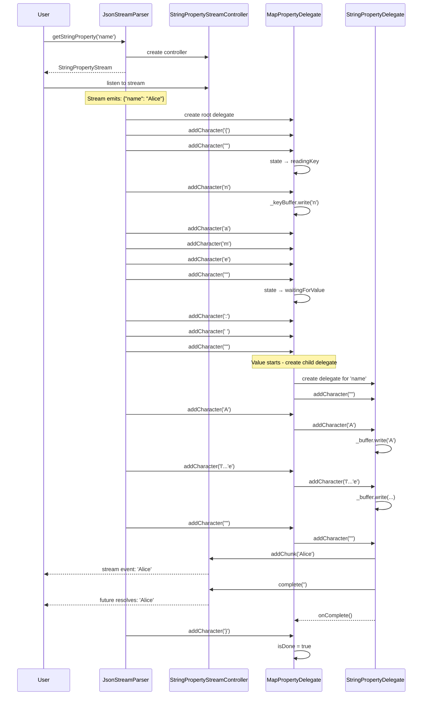
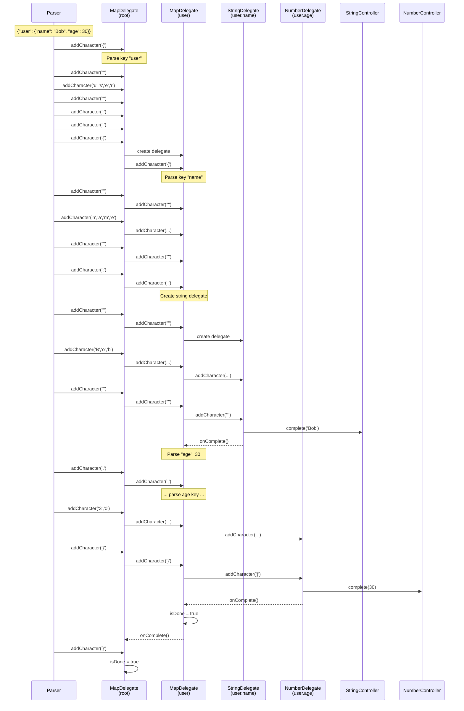
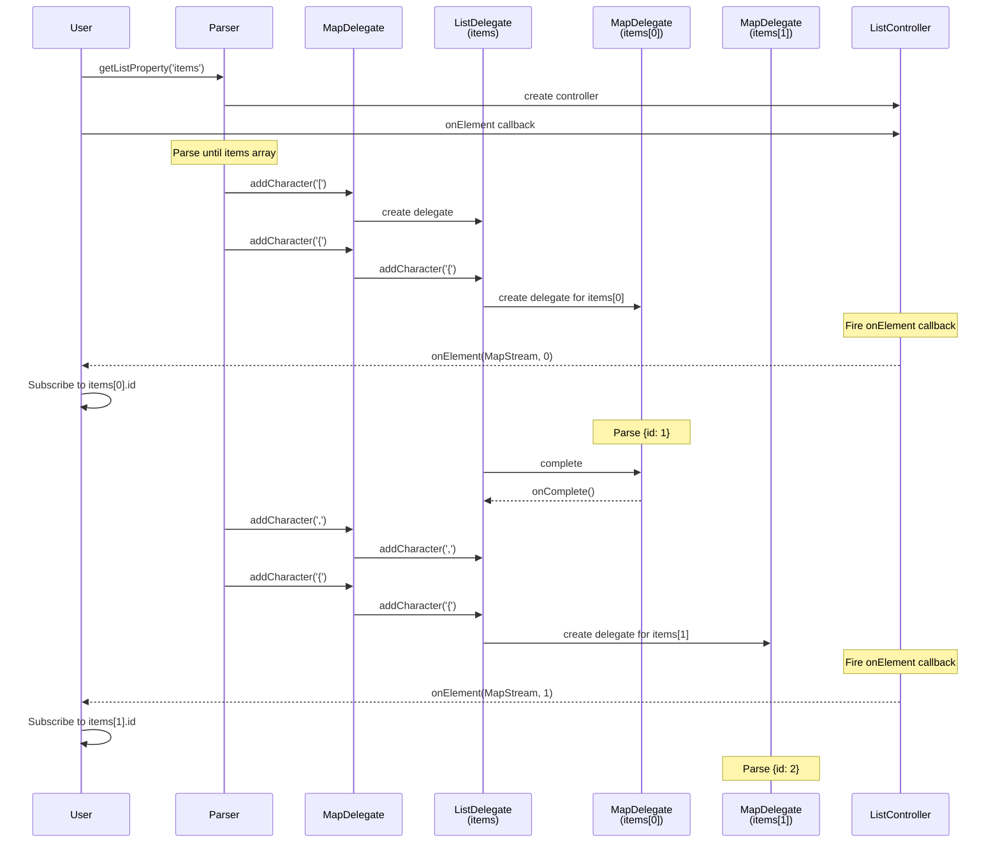
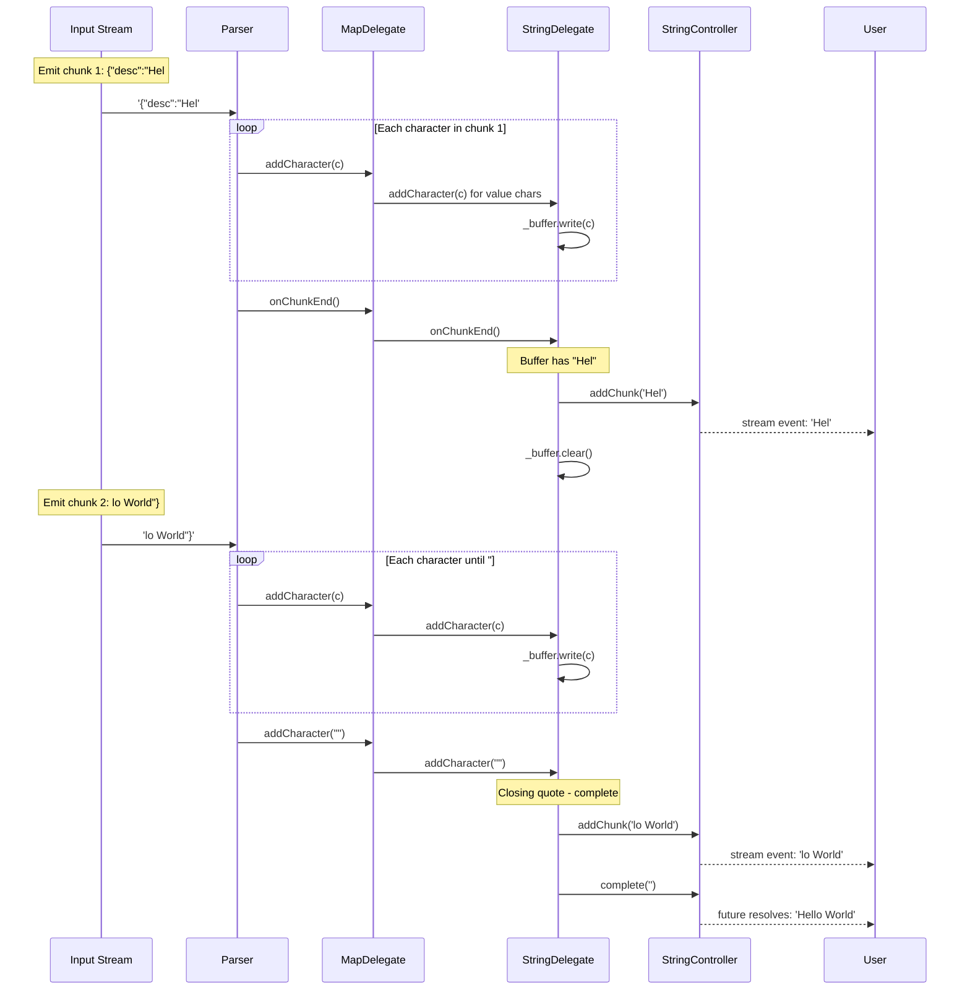
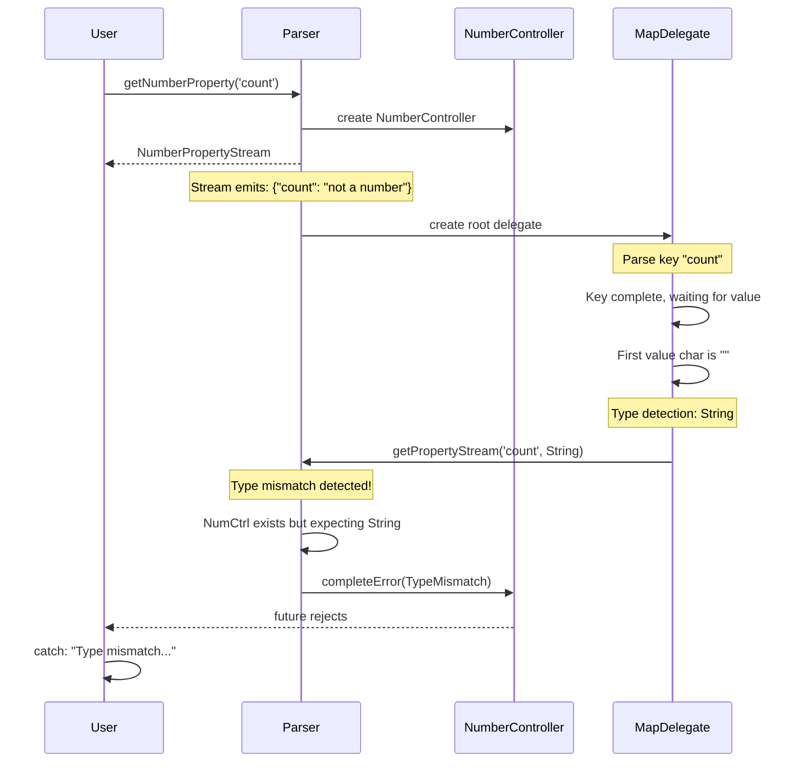
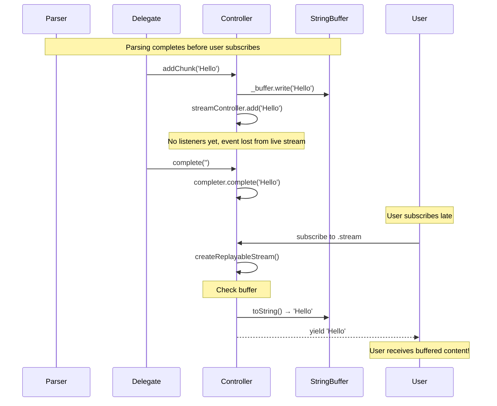
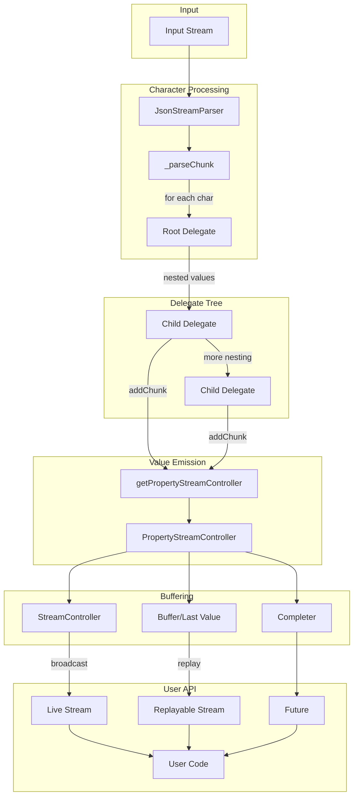

# Data Flow

This document provides complete examples of data flowing through the parser.

## Example 1: Simple String Property

**JSON:** `{"name": "Alice"}`

**User Code:**
```dart
final parser = JsonStreamParser(stream);
final nameStream = parser.getStringProperty('name');
nameStream.stream.listen((chunk) => print('Chunk: $chunk'));
final name = await nameStream.future;
print('Final: $name');
```

### Flow Diagram



---

## Example 2: Nested Map

**JSON:** `{"user": {"name": "Bob", "age": 30}}`

**User Code:**
```dart
final parser = JsonStreamParser(stream);
final name = await parser.getStringProperty('user.name').future;
final age = await parser.getNumberProperty('user.age').future;
```

### Flow Diagram



---

## Example 3: Array with onElement

**JSON:** `{"items": [{"id": 1}, {"id": 2}]}`

**User Code:**
```dart
final parser = JsonStreamParser(stream);
final items = parser.getListProperty('items');

items.onElement((element, index) {
  print('Element $index started');
  if (element is MapPropertyStream) {
    element.getNumberProperty('id').future.then((id) {
      print('Item $index has id: $id');
    });
  }
});
```

### Flow Diagram



---

## Example 4: Chunked String Streaming

**Input:** Stream emits `["{"desc":"Hel", "lo World"}"]` as two chunks

**User Code:**
```dart
final parser = JsonStreamParser(stream);
parser.getStringProperty('desc').stream.listen((chunk) {
  print('Received: "$chunk"');
});
```

### Flow Diagram



### Output:
```
Received: "Hel"
Received: "lo World"
```

---

## Example 5: Type Mismatch Error

**JSON:** `{"count": "not a number"}`

**User Code:**
```dart
final parser = JsonStreamParser(stream);
try {
  final count = await parser.getNumberProperty('count').future;
} catch (e) {
  print('Error: $e');
}
```

### Flow Diagram



### Output:
```
Error: Exception: Type mismatch at path "count": 
requested Number but found String in JSON
```

---

## Example 6: Late Subscription with Replay

**JSON:** `{"message": "Hello"}`

**Scenario:** User subscribes to stream AFTER parsing completes

```dart
final controller = StreamController<String>();
final parser = JsonStreamParser(controller.stream);

// Add all JSON at once
controller.add('{"message": "Hello"}');
controller.close();

// Wait a bit, then subscribe
await Future.delayed(Duration(milliseconds: 100));

// Even though parsing is done, stream should replay
final chunks = <String>[];
await for (final chunk in parser.getStringProperty('message').stream) {
  chunks.add(chunk);
}
print('Chunks: $chunks');  // ["Hello"]
```

### How Replay Works



---

## Summary: Complete Data Flow



---

## Key Takeaways

1. **Characters flow down** through delegate hierarchy
2. **Values flow up** through controller system
3. **Buffers enable replay** for late subscribers
4. **onChunkEnd flushes** partial string buffers
5. **Type mismatches** are caught at controller creation time
6. **Callbacks fire early** (before values complete)
