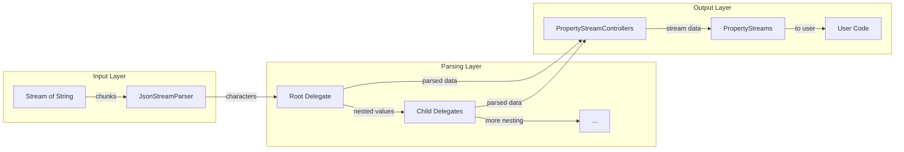
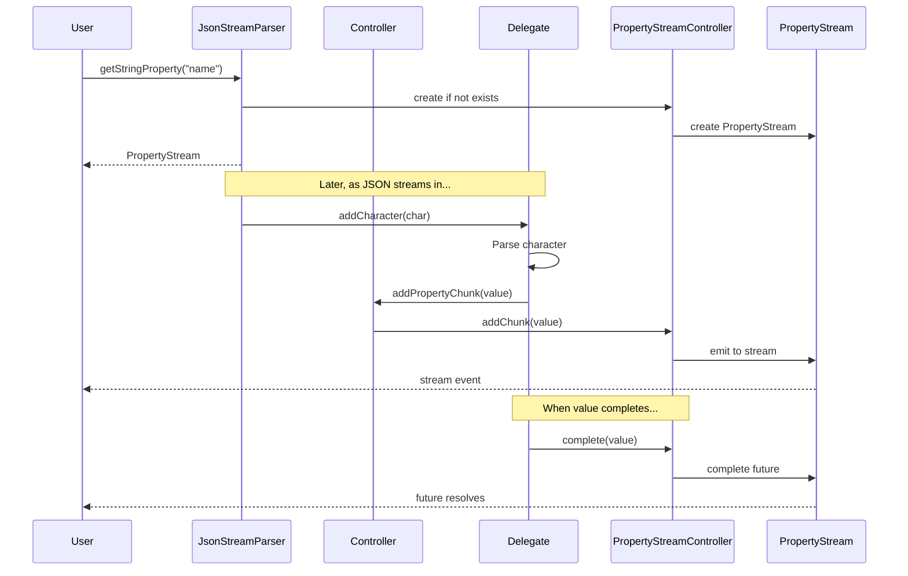
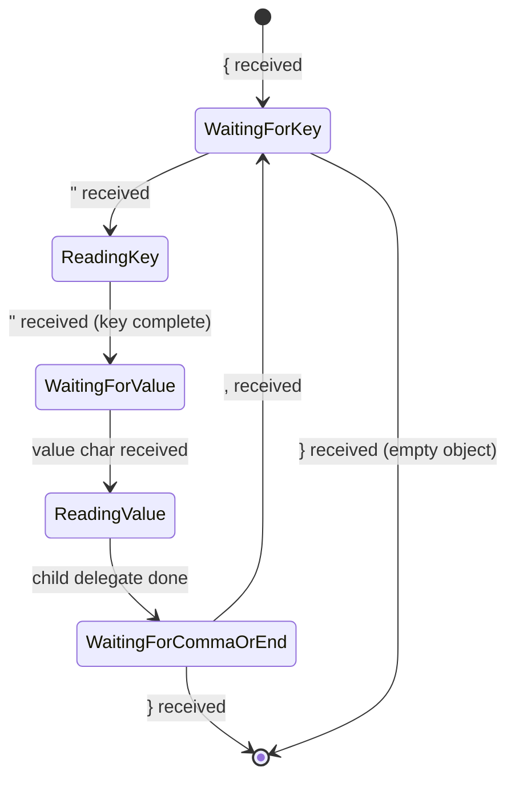

# Architecture Overview

This document provides a high-level overview of the JSON Stream Parser architecture.

## Design Philosophy

The JSON Stream Parser is designed with these core principles:

1. **Streaming First**: Process JSON as it arrives, character by character
2. **Reactive**: Emit values as soon as they're available, not just at completion
3. **Memory Efficient**: Don't buffer entire JSON documents; process incrementally
4. **LLM Optimized**: Handle common LLM output patterns (preambles, trailing text, etc.)

## System Architecture



## Core Components

### 1. JsonStreamParser (Entry Point)

The main class that users interact with. It:
- Consumes the input `Stream<String>`
- Creates the root delegate when JSON starts
- Manages all PropertyStreamControllers
- Provides getter methods for accessing property streams

### 2. JsonStreamParserController (Internal API)

An internal facade that provides delegates with controlled access to parser functionality:
- `addPropertyChunk()` - Send parsed values to stream controllers
- `getPropertyStreamController()` - Get/create controllers for paths
- `getPropertyStream()` - Get PropertyStream objects for paths
- `emitLog()` - Emit observability events

### 3. PropertyDelegates (Parsing Logic)

Workers that handle parsing specific JSON value types:
- One delegate per JSON value being parsed
- Delegates can create child delegates for nested values
- Each delegate manages its own state machine

### 4. PropertyStreamControllers (State Management)

Manage the streams and completers for each property path:
- Buffer values for replay
- Handle multiple subscribers
- Complete futures when parsing finishes

### 5. PropertyStreams (User API)

User-facing wrapper objects that provide:
- `.stream` - Reactive stream of values/chunks
- `.future` - Future that completes with final value
- Chainable property getters for nested access

## Data Flow



## State Machines

Each delegate type has its own state machine. Here's the MapPropertyDelegate as an example:



## Yap Filter

The parser includes a "yap filter" that automatically stops parsing after the root JSON element completes. This handles LLMs that add explanatory text after JSON:

```
Here is the data you requested:
{"name": "John", "age": 30}
I hope this helps! Let me know if you need anything else.
```

With `closeOnRootComplete: true` (default), only the JSON object is parsed.

## Next Steps

- [Core Components](./core-components.md) - Detailed component documentation
- [Delegates](./delegates.md) - How delegates work
- [Mechanisms](./mechanisms.md) - Pathing, streaming, and nesting systems
