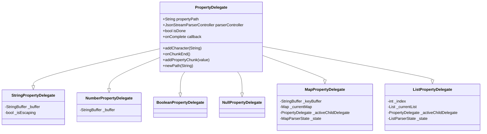
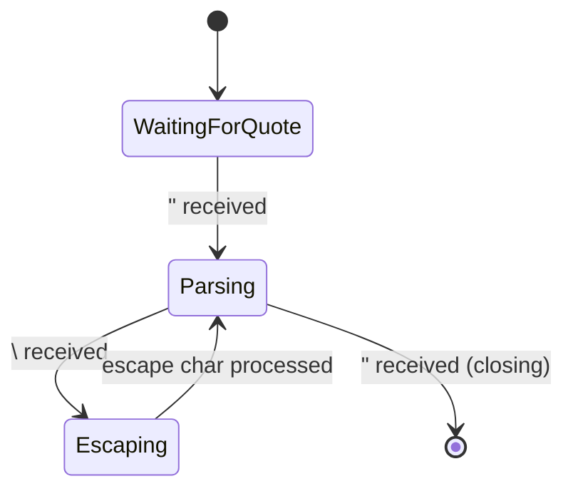
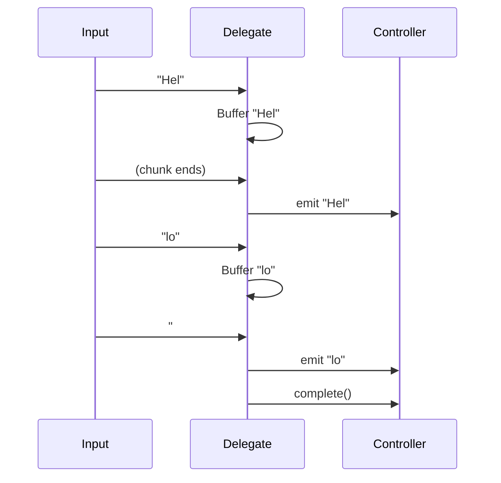
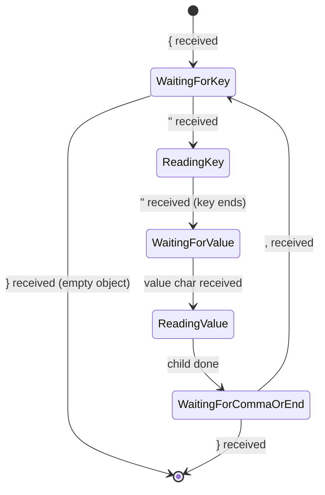
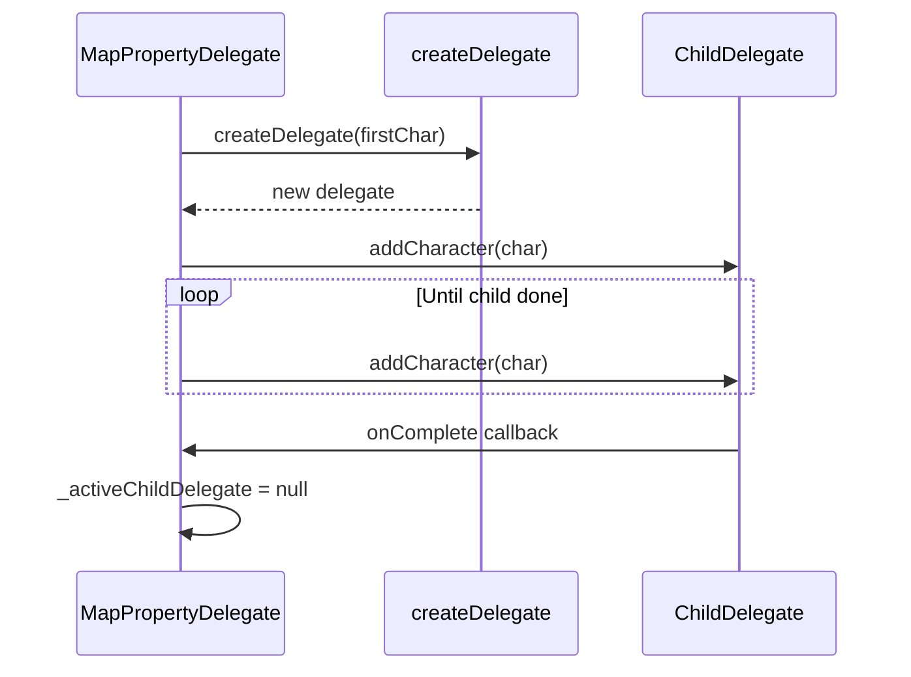
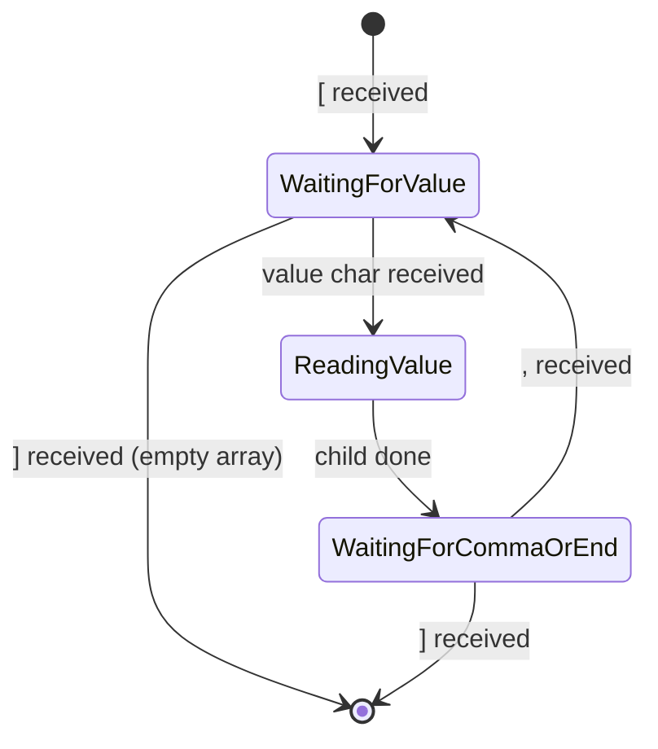
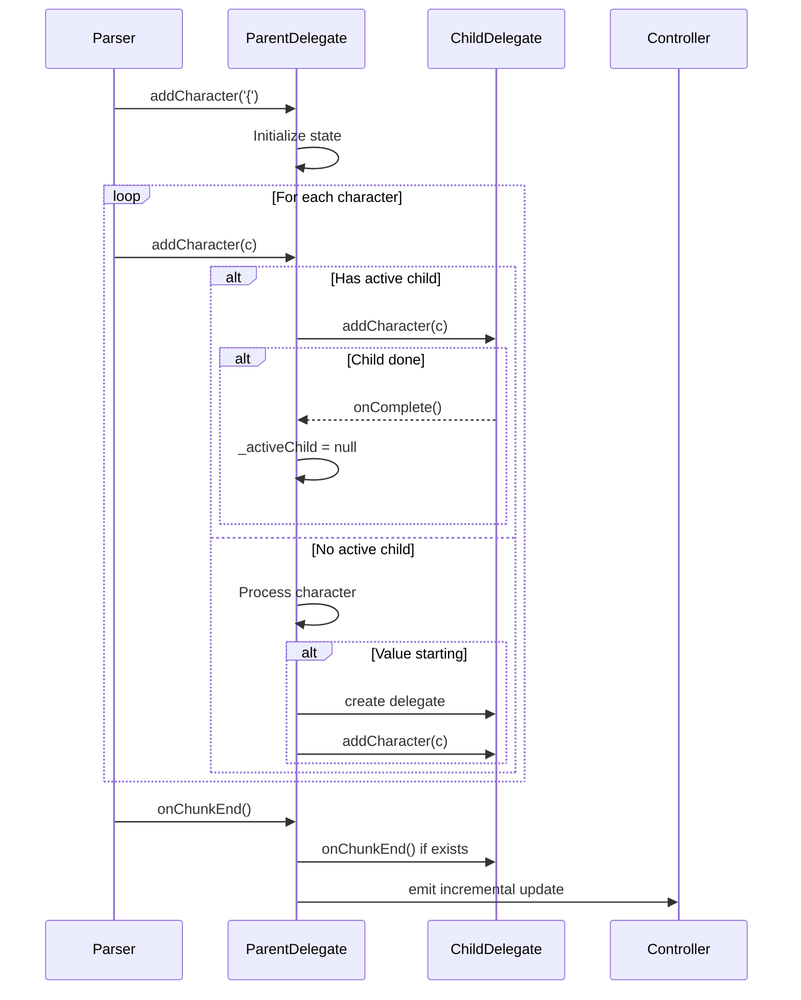

# Delegates

Delegates are the workers that parse specific JSON value types character by character.

## Overview



## Base Class: PropertyDelegate

**Location:** `lib/src/property_delegate.dart`

### Responsibilities

1. Hold common properties (path, controller, completion state)
2. Provide helper methods for child classes
3. Define the delegate interface

### Key Properties

```dart
abstract class PropertyDelegate {
  final String propertyPath;         // Dot-notation path to this value
  final JsonStreamParserController parserController;
  bool isDone = false;              // Whether parsing is complete
  final void Function()? onComplete; // Callback when done
}
```

### Key Methods

| Method | Purpose |
|--------|---------|
| `addCharacter(String)` | Process next character (abstract) |
| `onChunkEnd()` | Called when input chunk ends (for flushing buffers) |
| `addPropertyChunk(value)` | Send value to stream controller |
| `newPath(String)` | Build child property path |

---

## StringPropertyDelegate

**Location:** `lib/src/string_property_delegate.dart`

Parses JSON string values, handling escape sequences and emitting chunks.

### State

```dart
final StringBuffer _buffer = StringBuffer();  // Accumulated characters
bool _isEscaping = false;                     // Currently in escape sequence
bool _firstCharacter = true;                  // Waiting for opening quote
```

### State Machine



### Escape Sequence Handling

```dart
switch (character) {
  case '"':  _buffer.write('"');
  case '\\': _buffer.write('\\');
  case '/':  _buffer.write('/');
  case 'b':  _buffer.write('\b');
  case 'f':  _buffer.write('\f');
  case 'n':  _buffer.write('\n');
  case 'r':  _buffer.write('\r');
  case 't':  _buffer.write('\t');
  default:   _buffer.write('\\$character');  // Unknown escape
}
```

### Chunk Emission

Strings emit chunks at two points:
1. **On chunk end**: When input stream chunk ends, emit buffered content
2. **On completion**: Emit any remaining buffer before completing



---

## NumberPropertyDelegate

**Location:** `lib/src/number_property_delegate.dart`

Parses JSON number values (integers, floats, scientific notation).

### State

```dart
final StringBuffer _buffer = StringBuffer();  // Accumulated digits
```

### Valid Characters

```dart
bool _isValidNumberCharacter(String character) {
  return character == '-' ||
         character == '+' ||
         character == '.' ||
         character == 'e' ||
         character == 'E' ||
         (character.codeUnitAt(0) >= 48 && character.codeUnitAt(0) <= 57);
}
```

### Completion Detection

Numbers complete when a delimiter is encountered:
- `,` (comma - next element)
- `}` (object end)
- `]` (array end)
- Whitespace

**Important**: The delegate does NOT consume the delimiter - it lets the parent handle it.

---

## BooleanPropertyDelegate

**Location:** `lib/src/boolean_property_delegate.dart`

Parses JSON boolean values (`true`/`false`).

### Logic

```dart
void addCharacter(String character) {
  if (character == "t") {
    // Emit true immediately (optimistic)
    parserController.addPropertyChunk<bool>(chunk: true);
  } else if (character == "f") {
    // Emit false immediately (optimistic)
    parserController.addPropertyChunk<bool>(chunk: false);
  } else if (character == "," || character == "}" || character == "]") {
    isDone = true;
    onComplete?.call();
  }
}
```

### Design Note

The delegate only checks the first character (`t` or `f`) and immediately emits. It doesn't validate the full `true`/`false` spelling. This is an optimization for LLM output where malformed JSON is rare.

---

## NullPropertyDelegate

**Location:** `lib/src/null_property_delegate.dart`

Parses JSON `null` values.

### Logic

Similar to BooleanPropertyDelegate - checks for `n` and emits immediately.

---

## MapPropertyDelegate

**Location:** `lib/src/map_property_delegate.dart`

Parses JSON objects, managing nested key-value pairs.

### State

```dart
MapParserState _state = MapParserState.waitingForKey;
final StringBuffer _keyBuffer = StringBuffer();
PropertyDelegate? _activeChildDelegate;
List<String> _keys = [];
Map<String, dynamic> _currentMap = {};
```

### State Machine



### Child Delegate Management



### Key Discovery Flow

When a new key is discovered:
1. Add key to `_keys` list
2. Emit `mapKeyDiscovered` event
3. Determine value type from first character
4. Create PropertyStream for the path (triggers controller creation)
5. Set up stream subscription for incremental updates
6. Fire `onProperty` callbacks
7. Create child delegate
8. Start parsing value

---

## ListPropertyDelegate

**Location:** `lib/src/list_property_delegate.dart`

Parses JSON arrays, managing indexed elements.

### State

```dart
ListParserState _state = ListParserState.waitingForValue;
int _index = 0;
PropertyDelegate? _activeChildDelegate;
List<dynamic> _currentList = [];
```

### Value First Characters (O(1) lookup)

```dart
static const _valueFirstCharacters = <String>{
  '"', '{', '[', 't', 'f', 'n',
  '-', '0', '1', '2', '3', '4', '5', '6', '7', '8', '9',
};
```

### State Machine



### Element Path Construction

Elements are accessed via bracket notation:
```dart
String get _currentElementPath => '$propertyPath[$_index]';

// Examples:
// "items[0]"
// "data.users[2]"
// "matrix[1][3]"
```

---

## Delegate Lifecycle



---

## Performance Considerations

1. **StringBuffer over String**: All delegates use `StringBuffer` instead of string concatenation
2. **Type checks over reflection**: Use `is` operator instead of `runtimeType.toString()`
3. **Set for lookups**: `_valueFirstCharacters` is a Set for O(1) contains check
4. **Minimal allocations**: Reuse buffers where possible

---

## Next Steps

- [Property Streams & Controllers](./property-streams-controllers.md) - How values reach users
- [Mechanisms](./mechanisms.md) - Pathing, streaming, and nesting systems
