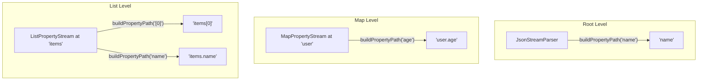
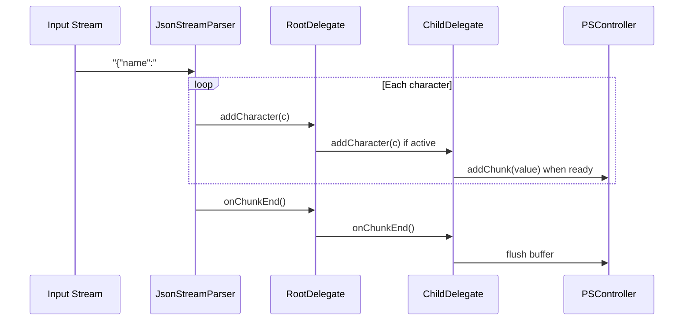
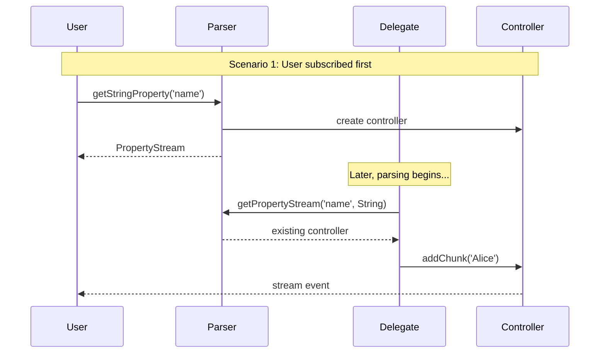
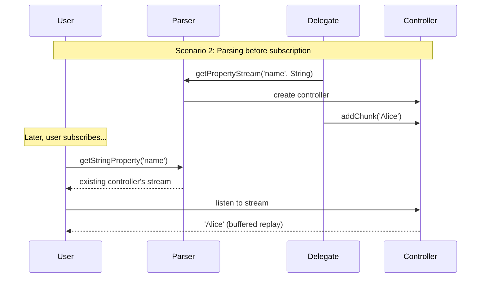
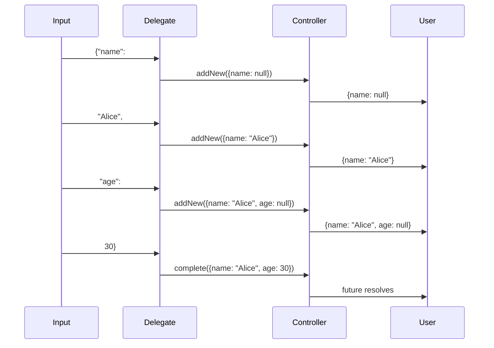
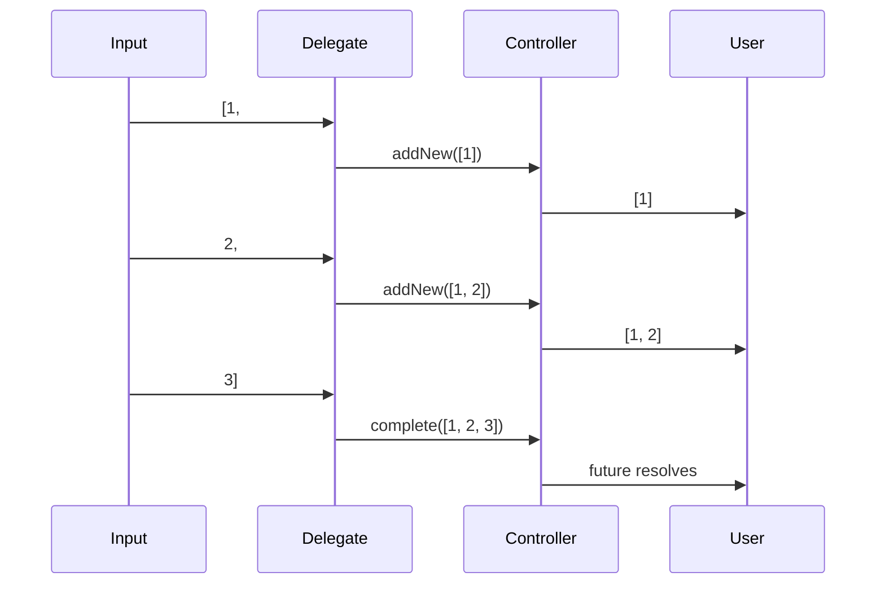
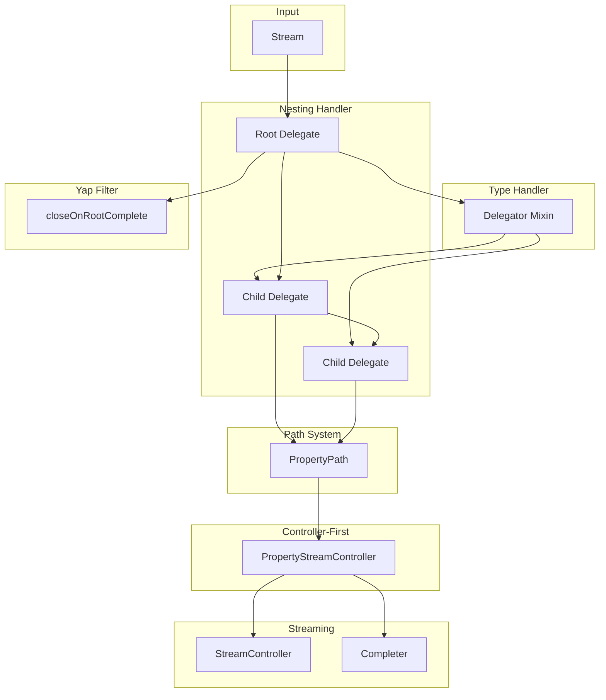

# Mechanisms & Systems

This document explains the key mechanisms that make the JSON Stream Parser work.

## 1. Path System

The path system allows accessing any value in a JSON structure using dot notation.

### Path Syntax

| Pattern | Example | Meaning |
|---------|---------|---------|
| Simple key | `name` | Root property |
| Nested key | `user.name` | Nested property |
| Array index | `items[0]` | First array element |
| Mixed | `users[2].name` | Third user's name |
| Deep nesting | `data.items[0].tags[1]` | Complex path |

### Path Construction



### Implementation Details

**PropertyGetterMixin.buildPropertyPath()**:
- Root parser: Returns key as-is
- MapPropertyStream: Prepends parent path with `.`
- ListPropertyStream: Handles bracket notation specially

```dart
// ListPropertyStream
@override
String buildPropertyPath(String key) {
  return _propertyPath.isEmpty
      ? key
      : (key.startsWith('[') 
          ? '$_propertyPath$key'      // items[0]
          : '$_propertyPath.$key');   // items.name
}
```

### Path Usage

```dart
// Direct path access
parser.getStringProperty('user.profile.name');

// Chained access (equivalent)
parser.getMapProperty('user')
      .getMapProperty('profile')
      .getStringProperty('name');

// Mixed with arrays
parser.getListProperty('users')
      .getMapProperty('[0]')
      .getStringProperty('name');
```

---

## 2. Streaming Mechanism

The streaming mechanism enables reactive access to values as they're parsed.

### Character-by-Character Flow



### Chunk-Based Input

The parser receives input as string chunks (not individual characters). Each chunk is split into characters internally:

```dart
void _parseChunk(String chunk) {
  for (final character in chunk.split('')) {
    _rootDelegate?.addCharacter(character);
  }
  _rootDelegate?.onChunkEnd();
}
```

### Why onChunkEnd Matters

For strings, the delegate buffers characters and emits them as chunks:

```
Input chunks: ["{"na", "me":"Al", "ice"}"]

Without onChunkEnd:
  Emissions: ["Alice"]  (only on string close)

With onChunkEnd:
  Emissions: ["na", "Al", "ice"]  (incremental)
```

This is crucial for:
- Real-time text display
- Progress indication
- Memory-efficient processing of large strings

---

## 3. Nesting Handler

The nesting system manages parent-child delegate relationships.

### Delegate Hierarchy

```mermaid
graph TD
    subgraph "JSON: {user: {name: 'Alice', tags: ['a', 'b']}}"
        A[MapPropertyDelegate<br/>path: ''] --> B[MapPropertyDelegate<br/>path: 'user']
        B --> C[StringPropertyDelegate<br/>path: 'user.name']
        B --> D[ListPropertyDelegate<br/>path: 'user.tags']
        D --> E[StringPropertyDelegate<br/>path: 'user.tags[0]']
        D --> F[StringPropertyDelegate<br/>path: 'user.tags[1]']
    end
```

### Active Child Management

Only one child delegate is active at a time per parent:

```dart
class MapPropertyDelegate {
  PropertyDelegate? _activeChildDelegate;
  
  void addCharacter(String character) {
    if (_state == MapParserState.readingValue) {
      _activeChildDelegate?.addCharacter(character);
      
      if (_activeChildDelegate?.isDone == true) {
        _activeChildDelegate = null;
        _state = MapParserState.waitingForCommaOrEnd;
      }
    }
  }
}
```

### Completion Callbacks

When a child completes, it notifies its parent:

```dart
// In MapPropertyDelegate
childDelegate = createDelegate(
  character,
  propertyPath: childPath,
  onComplete: () {
    if (_activeChildDelegate == childDelegate) {
      onChildComplete();
    }
  },
);
```

The check `_activeChildDelegate == childDelegate` prevents stale callbacks from old delegates.

### Closing Bracket Handling

Container types (Map, List) consume their own closing brackets:

```dart
// When } or ] is received:
if (childDelegate is ListPropertyDelegate ||
    childDelegate is MapPropertyDelegate) {
  return; // Don't reprocess - child consumed the bracket
}
// For primitives, reprocess the delimiter
```

This prevents the closing bracket from being processed twice.

---

## 4. Value Type Handler

The type handler creates appropriate delegates and controllers based on value type.

### Delegator Mixin (Factory)

```mermaid
graph TD
    A[First Character] --> B{Which type?}
    B -->|"| C[StringPropertyDelegate]
    B -->|"{"| D[MapPropertyDelegate]
    B -->|"["| E[ListPropertyDelegate]
    B -->|t/f| F[BooleanPropertyDelegate]
    B -->|n| G[NullPropertyDelegate]
    B -->|0-9/-| H[NumberPropertyDelegate]
```

### Type Detection in Delegates

```dart
// In MapPropertyDelegate, when starting a value:
final Type streamType;
if (character == '"') {
  streamType = String;
} else if (character == '{') {
  streamType = Map;
} else if (character == '[') {
  streamType = List;
} else if (character == 't' || character == 'f') {
  streamType = bool;
} else if (character == 'n') {
  streamType = Null;
} else {
  streamType = num;
}

// Create the stream BEFORE the delegate
final propertyStream = parserController.getPropertyStream(childPath, streamType);
```

### Type Mismatch Handling

When user expectations don't match JSON reality:

```dart
// User code:
parser.getStringProperty('age');  // Expects string

// JSON: {"age": 30}  // Actually a number

// Result:
// 1. Existing controller detected (StringPropertyStreamController)
// 2. Type incompatible with parsed value (num)
// 3. Controller's completer completed with error
// 4. User's future rejects with type mismatch error
```

---

## 5. Controller-First Pattern

The parser ensures controllers exist BEFORE delegates try to use them.

### Why Controller-First?





Both scenarios work because:
1. Controller is created on first access (by either delegate or user)
2. Buffered streams replay past values to late subscribers

---

## 6. Yap Filter

The yap filter handles LLM outputs that include text after JSON.

### Problem

```
Here's the JSON you requested:

{"name": "Alice", "age": 30}

Let me know if you need anything else! Feel free to ask questions.
```

Without the yap filter, the trailing text would cause parsing errors.

### Solution

```dart
if (closeOnRootComplete && _rootDelegate != null && _rootDelegate!.isDone) {
  _emitLog(ParseEvent(
    type: ParseEventType.yapFiltered,
    propertyPath: '',
    message: 'Yap filter triggered - ignoring text after root JSON',
  ));
  _streamSubscription.cancel();
  return;
}
```

### Behavior

| `closeOnRootComplete` | After Root Complete | Behavior |
|-----------------------|---------------------|----------|
| `true` (default) | Stop parsing | Trailing text ignored |
| `false` | Continue | May error on invalid JSON |

---

## 7. Incremental Map/List Updates

Collections emit their current state as parsing progresses.

### Map Incremental Updates



### List Incremental Updates



---

## 8. Callback Mechanisms

### onElement (Lists)

```dart
parser.getListProperty('items').onElement((element, index) {
  // Called when element[index] STARTS parsing
  // 'element' is a PropertyStream for the new element
  
  if (element is MapPropertyStream) {
    // Can subscribe to nested properties
    element.getStringProperty('name').stream.listen(...);
  }
});
```

### onProperty (Maps)

```dart
parser.getMapProperty('user').onProperty((property, key) {
  // Called when property 'key' STARTS parsing
  // 'property' is a PropertyStream for the new value
  
  print('Discovered key: $key');
  property.future.then((value) {
    print('Value for $key: $value');
  });
});
```

### Timing Guarantees

Both callbacks fire:
1. **Before** the value is fully parsed
2. **After** the PropertyStream is created
3. In order of appearance in JSON

This enables "arm the trap" patterns where you set up subscriptions before data arrives.

---

## Summary Diagram



---

## Next Steps

- [Data Flow](./data-flow.md) - Complete examples with data flow
- [Delegates](./delegates.md) - Detailed delegate documentation
