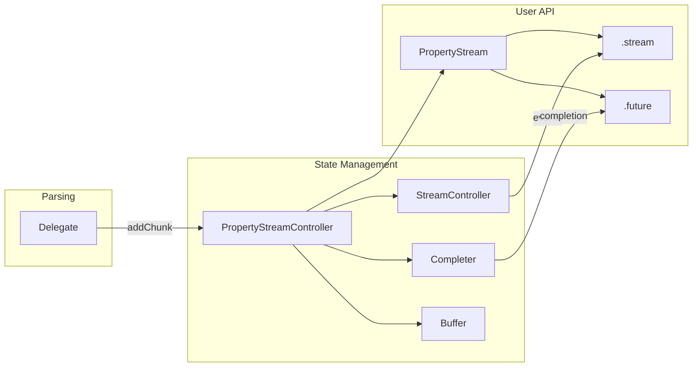
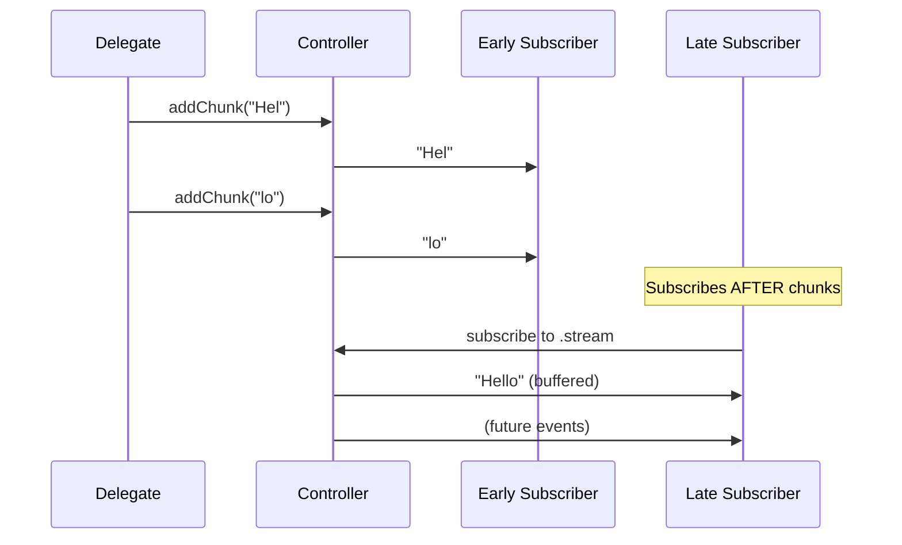
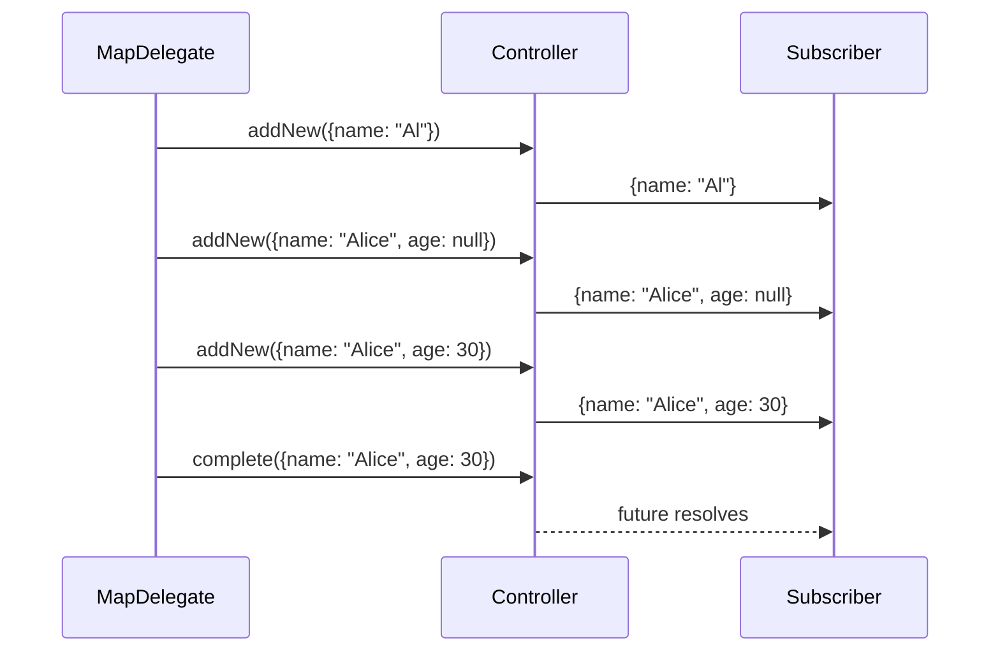
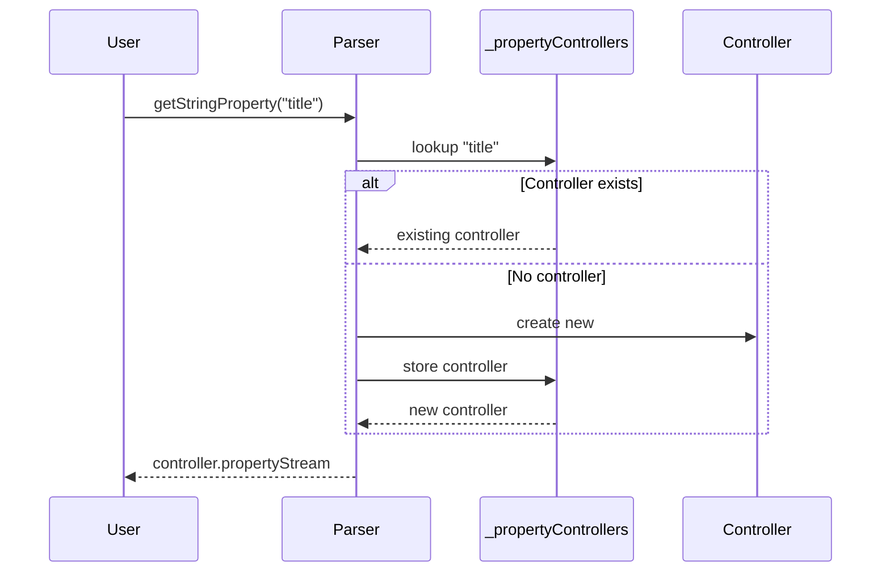

# Property Streams & Controllers

This document explains how parsed values flow from delegates to user code through the stream/controller architecture.

## Overview



## PropertyStreamController (Base)

**Location:** `lib/src/property_stream_controller.dart`

### Responsibilities

1. Manage stream controller and completer for a property
2. Track closed state
3. Handle logging callbacks
4. Provide completion mechanism

### Base Class Structure

```dart
abstract class PropertyStreamController<T> {
  // Abstract - subclasses create their own PropertyStream
  abstract final PropertyStream propertyStream;
  
  // State
  bool _isClosed = false;
  bool get isClosed => _isClosed;
  
  // Completion mechanism
  Completer<T> completer = Completer<T>();
  
  // References
  final JsonStreamParserController parserController;
  final String propertyPath;
  
  // Logging
  final List<void Function(ParseEvent)> _onLogCallbacks = [];
  
  void complete(T value) {
    if (!_isClosed) {
      completer.complete(value);
      onClose();
    }
  }
}
```

---

## StringPropertyStreamController

Handles streaming string values with buffering for replay.

### Structure

```dart
class StringPropertyStreamController extends PropertyStreamController<String> {
  late final StringPropertyStream propertyStream;
  
  final StringBuffer _buffer = StringBuffer();  // Accumulated chunks
  final streamController = StreamController<String>.broadcast();
  
  void addChunk(String chunk) {
    if (!_isClosed) {
      _buffer.write(chunk);
      streamController.add(chunk);
    }
  }
  
  void complete(String value) {
    if (!_isClosed) {
      completer.complete(_buffer.toString());
      streamController.close();
      onClose();
    }
  }
}
```

### Replayable vs Live Streams



**Live Stream (`.unbufferedStream`)**: Only emits new events
**Replayable Stream (`.stream`)**: Emits buffered content to new subscribers

---

## NumberPropertyStreamController

Simple controller for atomic number values.

```dart
class NumberPropertyStreamController extends PropertyStreamController<num> {
  late final NumberPropertyStream propertyStream;
  final streamController = StreamController<num>();
  
  void complete(num value) {
    if (!_isClosed) {
      completer.complete(value);
      streamController.close();
      onClose();
    }
  }
}
```

Numbers don't need buffering because they're atomic (single value).

---

## BooleanPropertyStreamController

Similar to NumberPropertyStreamController but for boolean values.

---

## NullPropertyStreamController

Similar to NumberPropertyStreamController but for null values.

---

## MapPropertyStreamController

Handles streaming map values with callbacks for property discovery.

### Structure

```dart
class MapPropertyStreamController extends PropertyStreamController<Map<String, Object?>> {
  late final MapPropertyStream propertyStream;
  
  final streamController = StreamController<Map<String, dynamic>>.broadcast();
  Map<String, dynamic>? _lastValue;  // Only latest state (O(1) memory)
  
  List<void Function(PropertyStream, String)> onPropertyCallbacks = [];
  
  void addNew(Map<String, dynamic> map) {
    if (!_isClosed) {
      _lastValue = map;
      streamController.add(map);
    }
  }
}
```

### Incremental Updates



### onProperty Callbacks

```dart
void addOnPropertyCallback(
  void Function(PropertyStream propertyStream, String key) callback,
) {
  onPropertyCallbacks.add(callback);
}
```

Called by MapPropertyDelegate when a new key is discovered.

---

## ListPropertyStreamController

Handles streaming list values with callbacks for element discovery.

### Structure

```dart
class ListPropertyStreamController<T extends Object?> 
    extends PropertyStreamController<List<T>> {
  late final ListPropertyStream<T> propertyStream;
  
  final streamController = StreamController<List<T>>.broadcast();
  List<T>? _lastValue;  // Only latest state (O(1) memory)
  
  List<void Function(PropertyStream, int)> onElementCallbacks = [];
  
  void addNew(List<T> list) {
    if (!_isClosed) {
      _lastValue = list;
      streamController.add(list);
    }
  }
}
```

---

## PropertyStream (Base)

**Location:** `lib/src/property_stream.dart`

User-facing wrapper that provides convenient access to values.

### Base Class

```dart
abstract class PropertyStream<T> {
  final Future<T> _future;
  Future<T> get future => _future;
  
  final JsonStreamParserController _parserController;
  String get _propertyPath;
  
  // Type conversion helpers
  MapPropertyStream get asMap => this as MapPropertyStream;
  ListPropertyStream get asList => this as ListPropertyStream;
  StringPropertyStream get asStr => this as StringPropertyStream;
  // etc...
  
  // Logging
  void onLog(void Function(ParseEvent event) callback);
}
```

---

## StringPropertyStream

```dart
class StringPropertyStream extends PropertyStream<String> {
  final Stream<String> _liveStream;
  final Stream<String> Function() _replayableStreamFactory;
  
  // Only new chunks (no replay)
  Stream<String> get unbufferedStream => _liveStream;
  
  // Replay past + new chunks
  Stream<String> get stream => _replayableStreamFactory();
}
```

### Usage Example

```dart
// Stream chunks as they arrive
parser.getStringProperty('description').stream.listen((chunk) {
  textDisplay += chunk;  // Accumulate for display
});

// Or wait for complete value
final description = await parser.getStringProperty('description').future;
```

---

## MapPropertyStream

```dart
class MapPropertyStream extends PropertyStream<Map<String, Object?>>
    with PropertyGetterMixin {
  
  Stream<Map<String, dynamic>> get unbufferedStream => _liveStream;
  Stream<Map<String, dynamic>> get stream => _replayableStreamFactory();
  
  // Callback for property discovery
  void onProperty(void Function(PropertyStream, String key) callback);
  
  // Chainable property access (from mixin)
  StringPropertyStream getStringProperty(String key);
  // etc...
}
```

### Chaining Example

```dart
// Chain to access nested properties
parser.getMapProperty('user')
    .getStringProperty('name')
    .stream.listen((name) {
  print('Name: $name');
});

// Or with shorthand
parser.map('user').str('name').stream.listen(...);
```

### onProperty Example

```dart
parser.getMapProperty('response').onProperty((stream, key) {
  print('Discovered property: $key');
  
  if (stream is StringPropertyStream) {
    stream.stream.listen((chunk) {
      print('$key chunk: $chunk');
    });
  }
});
```

---

## ListPropertyStream

```dart
class ListPropertyStream<T extends Object?> extends PropertyStream<List<T>>
    with PropertyGetterMixin {
  
  Stream<List<T>> get unbufferedStream => _liveStream;
  Stream<List<T>> get stream => _replayableStreamFactory();
  
  // Callback for element discovery
  void onElement(void Function(PropertyStream, int index) callback);
  
  // Chainable property access
  StringPropertyStream getStringProperty(String key);  // for "[0]"
  // etc...
}
```

### onElement Example

```dart
parser.getListProperty('items').onElement((element, index) {
  print('Element $index started');
  
  if (element is MapPropertyStream) {
    element.getStringProperty('name').future.then((name) {
      print('Item $index: $name');
    });
  }
});
```

---

## Controller Registry

The parser maintains a map of property path → controller:

```dart
final Map<String, PropertyStreamController> _propertyControllers = {};
```

### Controller Creation Flow



### Type Checking

When a user requests a property with a specific type, but the JSON contains a different type:

```dart
// User code
final name = parser.getStringProperty('user.name');

// But JSON has: {"user": {"name": 123}}

// Result: Controller's completer is completed with an error
// The error includes: "Type mismatch at path 'user.name': 
//                      requested String but found num in JSON"
```

---

## Memory Management

### Buffering Strategy

| Type | Buffering | Memory |
|------|-----------|--------|
| String | Full content | O(n) where n = string length |
| Map | Latest state only | O(1) per map |
| List | Latest state only | O(1) per list |
| Number | None | O(1) |
| Boolean | None | O(1) |
| Null | None | O(1) |

### Why Latest-Only for Collections?

Maps and lists only keep the latest state because:
1. Memory efficiency - don't store every intermediate state
2. Late subscribers get current state, not history
3. Future resolves with final complete value anyway

---

## Next Steps

- [Mechanisms](./mechanisms.md) - Pathing, streaming, and nesting systems
- [Data Flow](./data-flow.md) - Complete data flow examples
